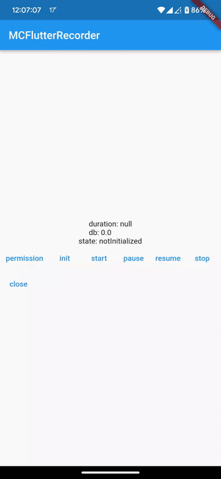

# mc_flutter_recorder
A flutter plugin for recording audio.

Not only does it support basic recording functions, but it also supports audio interruption policy control and other exception handling.

Only support wav format for now.



# Usage

```dart
import 'package:mc_flutter_recorder/mc_flutter_recorder.dart';

_mcRecorderPlugin = McFlutterRecorder();

// You need to require permission before recording
final granted = await Permission.microphone.isGranted;
if (!granted) {
  await Permission.microphone.request();
}

// Initialize the recorder
_mcRecorderPlugin.init(RecorderConfig( 
    filePath: path,
    sampleRate: 16000,
    channel: RecorderChannel.mono,
    pcmBitRate: PcmBitRate.pcm16Bit,
    period: const Duration(milliseconds: 100),
    interruptedBehavior: InterruptedBehavior.stop,
    freeDisk: 100,
));

// Start recording
await _mcRecorderPlugin.start();

// Resume recording
await _mcRecorderPlugin.resume();

// Pause recording
await _mcRecorderPlugin.pause();

// Stop recording
await _mcRecorderPlugin.stop();

// Close recorder 
await _mcRecorderPlugin.close();

_mcRecorderPlugin.recordStateStream.listen((state) {
  // Do something with the state
});

_mcRecorderPlugin.recordInfoStream.listen((info) {
  // Do something with the info
});

_mcRecorderPlugin.recordErrorStream.listen((error) {
  // Do something with the error
});
```

## Android

Set the compileSdkVersion to 33 in `android/app/build.gradle`:

```groovy
android {
    compileSdkVersion 33
}
```

## iOS
Add the following keys to your Info.plist file, located in <project root>/ios/Runner/Info.plist:

NSMicrophoneUsageDescription - describe why your app needs access to the microphone

```
<key>NSMicrophoneUsageDescription</key>
<string>Can We Use Your Microphone Please</string>
```

# Contributions
We welcome contributions to this project. Please fork this repository and submit pull requests for any features or bug fixes you may have.

# License
This project is licensed under the MIT License - see the [LICENSE](LICENSE) file for details.